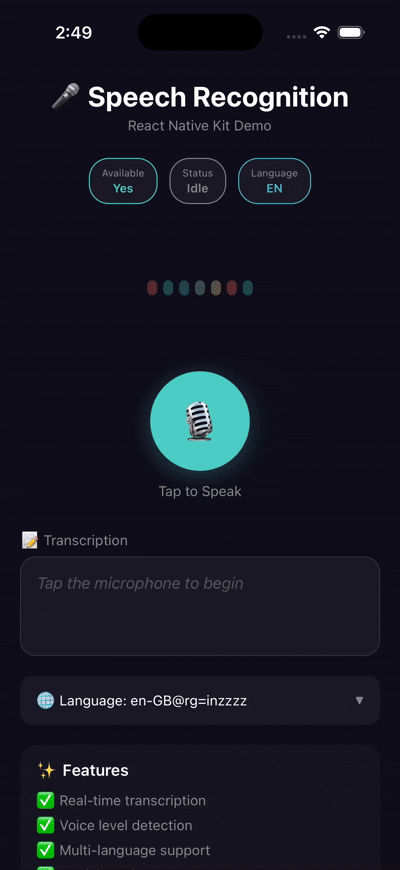

<a href="https://gauthamvijay.com">
  <picture>
    
  </picture>
</a>

# react-native-speech-recognition-kit

A **React Native TurboModule** for native speech recognition on iOS and Android. Uses Apple's **SFSpeechRecognizer** and Google's **SpeechRecognizer** — no cloud APIs, no third-party services, just pure on-device speech-to-text.

---

## ✨ Features

- 🎤 **Real-time transcription** — Stream speech-to-text as the user speaks
- 📊 **Voice level detection** — Get audio volume levels for visualizations
- 🌍 **Multi-language support** — 50+ languages supported on both platforms
- ⚡ **Partial results** — See text as it's being recognized
- 🔒 **On-device processing** — No cloud APIs, works offline (iOS)
- 📱 **TurboModule architecture** — Fast, synchronous native bridge
- 🎯 **Works with Expo** — Compatible with Expo Dev Client (not Expo Go)

---

## 🎥 Demo

<table>
  <tr>
    <th align="center">🍏 iOS</th>
  </tr>
  <tr>
    <td align="center">
      
    </td>
  </tr>
</table>

---

> [!NOTE]
>
> - Originally built for my production Voice AI app.
> - Open-sourced so the React Native community can use **native-quality speech decoding** on both iOS & Android.
> - Pull requests welcome — especially improvements to continuous dictation + multi-language support.
> - Test on a **real Android device**, not the Android Emulator (emulator lacks speech services).
> - This library is an updated fork of [react-native-voice-to-text](https://github.com/sufyan297/react-native-voice-to-text) with ESM module fixes and additional features.

---

## 📦 Installation

```bash
npm install react-native-speech-recognition-kit
# or
yarn add react-native-speech-recognition-kit
```

### iOS

```bash
cd ios && pod install
```

### Expo

This library uses **TurboModules** (not Expo Modules), so it works with:

| Expo Setup          | Supported                    |
| ------------------- | ---------------------------- |
| **Expo Dev Client** | ✅ Yes                       |
| **Expo Prebuild**   | ✅ Yes                       |
| **Expo Go**         | ❌ No (requires native code) |

```bash
# For Expo projects, run prebuild first
npx expo prebuild
npx expo run:ios
# or
npx expo run:android
```

---

> [!IMPORTANT]
>
> - Works on **iOS 13+** and **Android 6+**
> - No third-party APIs required (uses **SFSpeechRecognizer** / **android.speech.SpeechRecognizer**)
> - Android requires Google Speech Services (pre-installed on most devices)

---

## ⚙️ Native Setup

### iOS Setup (Required)

#### 1. Add permissions to `Info.plist`

```xml
<key>NSSpeechRecognitionUsageDescription</key>
<string>Speech recognition is used to convert your voice to text.</string>
<key>NSMicrophoneUsageDescription</key>
<string>Microphone access is required for speech input.</string>
```

#### 2. Enable Speech Recognition Entitlement

Xcode → Target → Signing & Capabilities → `+ Capability` → **Speech Recognition**

---

### Android Setup (Required)

#### 1. Add permissions to `AndroidManifest.xml`

```xml
<uses-permission android:name="android.permission.RECORD_AUDIO" />
```

#### 2. Declare Speech Recognizer Service Query (Android 11+)

Inside `<manifest>` add:

```xml
<queries>
  <intent>
    <action android:name="android.speech.RecognitionService" />
  </intent>
</queries>
```

#### 3. (Optional) Ensure Google Speech Engine is Available

Most devices ship with Google Speech Services. If using AOSP or emulator, ensure this package is installed:

```
com.google.android.googlequicksearchbox
```

---

## 📖 API Reference

### Functions

| Function                            | Description                                           |
| ----------------------------------- | ----------------------------------------------------- |
| `startListening()`                  | Start speech recognition                              |
| `stopListening()`                   | Stop speech recognition                               |
| `destroy()`                         | Clean up resources                                    |
| `isRecognitionAvailable()`          | Check if speech recognition is available              |
| `getRecognitionLanguage()`          | Get current recognition language                      |
| `setRecognitionLanguage(lang)`      | Set recognition language (e.g., `'en-US'`, `'es-ES'`) |
| `getSupportedLanguages()`           | Get list of supported language codes                  |
| `addEventListener(event, callback)` | Subscribe to speech events                            |

### Events

```typescript
import { speechRecogntionEvents } from 'react-native-speech-recognition-kit';

// All available events
speechRecogntionEvents.START; // Recognition started
speechRecogntionEvents.BEGIN; // User started speaking
speechRecogntionEvents.END; // Recognition ended
speechRecogntionEvents.RESULTS; // Final transcription result
speechRecogntionEvents.PARTIAL_RESULTS; // Live partial transcription
speechRecogntionEvents.VOLUME_CHANGED; // Audio volume level changed
speechRecogntionEvents.ERROR; // Error occurred
```

### Event Payloads

```typescript
// RESULTS & PARTIAL_RESULTS
{
  value: string;                    // Transcribed text
  results?: {
    transcriptions: Array<{
      text: string;
      confidence: number;           // 0.0 - 1.0
    }>;
  };
}

// VOLUME_CHANGED
{
  value: number;                    // dB level (typically -60 to 0)
}

// ERROR
{
  message: string;
  code: number;
}
```

---

## 🚀 Usage

### Basic Example

```tsx
import { useEffect, useState } from 'react';
import { View, Text, TouchableOpacity } from 'react-native';
import {
  addEventListener,
  startListening,
  stopListening,
  destroy,
  speechRecogntionEvents,
} from 'react-native-speech-recognition-kit';

const App = () => {
  const [text, setText] = useState('');
  const [isListening, setIsListening] = useState(false);

  useEffect(() => {
    const resultsListener = addEventListener(
      speechRecogntionEvents.RESULTS,
      (event) => setText(event.value)
    );

    const partialListener = addEventListener(
      speechRecogntionEvents.PARTIAL_RESULTS,
      (event) => setText(event.value || '')
    );

    const startListener = addEventListener(speechRecogntionEvents.START, () =>
      setIsListening(true)
    );

    const endListener = addEventListener(speechRecogntionEvents.END, () =>
      setIsListening(false)
    );

    return () => {
      destroy();
      resultsListener.remove();
      partialListener.remove();
      startListener.remove();
      endListener.remove();
    };
  }, []);

  const handlePress = async () => {
    if (isListening) {
      await stopListening();
    } else {
      await startListening();
    }
  };

  return (
    <View style={{ flex: 1, justifyContent: 'center', padding: 20 }}>
      <Text style={{ fontSize: 18, marginBottom: 20 }}>
        {text || 'Tap the button and speak...'}
      </Text>
      <TouchableOpacity
        onPress={handlePress}
        style={{
          backgroundColor: isListening ? '#FF6B6B' : '#4ECDC4',
          padding: 20,
          borderRadius: 10,
          alignItems: 'center',
        }}
      >
        <Text style={{ color: 'white', fontSize: 16 }}>
          {isListening ? '⏹️ Stop' : '🎤 Start'}
        </Text>
      </TouchableOpacity>
    </View>
  );
};

export default App;
```

### With Voice Level Visualization

```tsx
import { useEffect, useState } from 'react';
import {
  addEventListener,
  startListening,
  speechRecogntionEvents,
} from 'react-native-speech-recognition-kit';

const App = () => {
  const [voiceLevel, setVoiceLevel] = useState(-60);

  useEffect(() => {
    const volumeListener = addEventListener(
      speechRecogntionEvents.VOLUME_CHANGED,
      (event) => {
        // event.value is in dB, typically -60 (silent) to -20 (loud)
        setVoiceLevel(event.value);
      }
    );

    return () => volumeListener.remove();
  }, []);

  // Use voiceLevel to drive audio visualizations
  const normalizedLevel = Math.max(0, (voiceLevel + 60) / 40); // 0 to 1

  return (
    <View
      style={{ height: 50 * normalizedLevel, backgroundColor: '#4ECDC4' }}
    />
  );
};
```

### Multi-Language Support

```tsx
import {
  setRecognitionLanguage,
  getRecognitionLanguage,
  getSupportedLanguages,
} from 'react-native-speech-recognition-kit';

// Get current language
const currentLang = await getRecognitionLanguage();
console.log(currentLang); // 'en-US'

// Get all supported languages
const languages = await getSupportedLanguages();
console.log(languages); // ['en-US', 'es-ES', 'fr-FR', 'de-DE', ...]

// Change language
await setRecognitionLanguage('es-ES'); // Spanish
await setRecognitionLanguage('ja-JP'); // Japanese
await setRecognitionLanguage('hi-IN'); // Hindi
```

---

## 🧩 Platform Support

| Platform       | Status             | Engine                            | Offline Support |
| -------------- | ------------------ | --------------------------------- | --------------- |
| **iOS 13+**    | ✅ Fully supported | `SFSpeechRecognizer`              | ✅ Yes          |
| **Android 6+** | ✅ Fully supported | `android.speech.SpeechRecognizer` | ⚠️ Limited      |

---

## 🛠️ Under the Hood

```
┌─────────────────────────────────────────────────────────────┐
│                     JavaScript Layer                        │
│                                                             │
│  startListening() ──► TurboModule Bridge ──► Native Module  │
│                                                             │
└─────────────────────────────────────────────────────────────┘
                              │
              ┌───────────────┴───────────────┐
              ▼                               ▼
┌─────────────────────────┐     ┌─────────────────────────┐
│          iOS            │     │        Android          │
│                         │     │                         │
│  • SFSpeechRecognizer   │     │  • SpeechRecognizer     │
│  • AVAudioEngine        │     │  • RecognitionListener  │
│  • Audio Buffer Stream  │     │  • AudioRecord Pipeline │
│                         │     │                         │
└─────────────────────────┘     └─────────────────────────┘
```

Events are streamed to JavaScript via **TurboModule Event Emitters** for real-time updates.

---

## 🔧 Troubleshooting

### iOS

| Issue                          | Solution                                                |
| ------------------------------ | ------------------------------------------------------- |
| "Speech permission denied"     | Add `NSSpeechRecognitionUsageDescription` to Info.plist |
| "Microphone permission denied" | Add `NSMicrophoneUsageDescription` to Info.plist        |
| "Recognizer not available"     | Check device supports speech recognition                |

### Android

| Issue                              | Solution                                               |
| ---------------------------------- | ------------------------------------------------------ |
| "Speech recognition not available" | Install Google app or use a real device                |
| No results on emulator             | Use a physical device (emulator lacks speech services) |
| "Insufficient permissions"         | Request `RECORD_AUDIO` permission at runtime           |

---

```bash
# Clone the repo
git clone https://github.com/user/react-native-speech-recognition-kit.git

# Install dependencies
yarn install

# Run example app
cd example
yarn ios
# or
yarn android
```

---

## 🪪 License

MIT © [Gautham Vijayan](https://gauthamvijay.com)

---

<p align="center">
  <sub>Built with ❤️ for the React Native community</sub>
</p>
