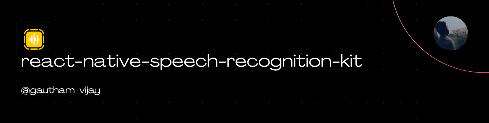

<a href="https://gauthamvijay.com">
  <picture>
    
  </picture>
</a>

# react-native-speech-recognition-kit

A **React Native TurboModule** that bridges Apple’s **Speech Recognition (SFSpeechRecognizer)** APIs for iOS and Google’s **SpeechRecognizer API** for Android.  
This library lets your React Native app **request microphone & speech permission**, **start speech-to-text recognition**, and **retrieve transcribed text** in real time.

> [!NOTE]
>
> - Originally built for my production Voice AI app.
> - Open-sourced so the React Native community can use **native-quality speech decoding** on both iOS & Android.
> - Pull requests welcome — especially improvements to continuous dictation + multi-language support.
> - Test in Real Android Device and not in Android Emulator

---

## 📦 Installation

```

npm install react-native-speech-recognition-kit

```

Then install pods (iOS only):

```

cd ios && pod install

````

---

> [!IMPORTANT]
>
> - Works on **iOS 13+** and **Android 6+**
> - No third-party APIs required (uses **SFSpeechRecognizer** / **android.speech.SpeechRecognizer**)

---

## ✅ Required Native Setup

### iOS Setup (Required)

#### 1. Add permissions to **Info.plist**

```xml
<key>NSSpeechRecognitionUsageDescription</key>
<string>Speech recognition is used to convert your voice to text.</string>
<key>NSMicrophoneUsageDescription</key>
<string>Microphone access is required for speech input.</string>
````

#### 2. Enable Speech Recognition Entitlement

Xcode → Target → Signing & Capabilities → `+ Capability` → **Speech Recognition**

---

### Android Setup (Required)

#### 1. Add permissions to **AndroidManifest.xml**

```
<uses-permission android:name="android.permission.RECORD_AUDIO" />
```

#### 2. Declare Speech Recognizer Service Query (Android 11+)

Inside `<manifest>` add:

```xml
<queries>
  <intent>
    <action android:name="android.speech.RecognitionService" />
  </intent>
</queries>
```

#### 3. (Optional) Ensure Google Speech Engine Available

Most devices ship with it. If using AOSP or emulator:

```
com.google.android.googlequicksearchbox
```

must be installed.

---

## 🧰 AppDelegate / MainActivity Setup

No changes required.

---

## ⚙️ Usage

```tsx
import {
  Platform,
  StyleSheet,
  ActivityIndicator,
  Image,
  Text,
  View,
  TextInput,
  Dimensions,
  TouchableOpacity,
} from 'react-native';

import { useEffect, useState } from 'react';

import {
  addEventListener,
  startListening,
  stopListening,
  destroy,
  speechRecogntionEvents,
} from 'react-native-speech-recognition-kit';

const App = () => {
  const [text, setText] = useState<string>('');

  const [recognizing, setRecognizing] = useState<boolean>(false);

  const [speechRecogntionLoader, setSpeechRecognitionLoader] =
    useState<boolean>(false);

  const onTextChange = (v: string) => {
    setText(v);
  };

  useEffect(() => {
    const resultsListener = addEventListener(
      speechRecogntionEvents.RESULTS,
      (event) => {
        setText(event.value);
      }
    );

    const speechPartialResultsSubscription = addEventListener(
      speechRecogntionEvents.PARTIAL_RESULTS,
      (event) => {
        setText(event.value || '');
      }
    );

    const startListener = addEventListener(speechRecogntionEvents.START, () =>
      setRecognizing(true)
    );

    const endListener = addEventListener(speechRecogntionEvents.END, () =>
      setRecognizing(false)
    );

    return () => {
      destroy();
      startListener.remove();
      resultsListener.remove();
      speechPartialResultsSubscription.remove();
      endListener.remove();
    };
  }, []);

  const handleSpeechStart = async () => {
    try {
      if (recognizing) {
        await stopListening();
      } else {
        setSpeechRecognitionLoader(true);
        await startListening();
        setSpeechRecognitionLoader(false);
      }
    } catch (error) {
      setSpeechRecognitionLoader(false);
    }
  };

  return (
    <View style={styles.mainContainer}>
      <View style={styles.inputContainer}>
        <TextInput
          multiline
          value={text}
          onChangeText={onTextChange}
          style={styles.textInput}
          placeholder={'Message...'}
        />

        <View>
          {speechRecogntionLoader ? (
            <ActivityIndicator
              size={'small'}
              color={'black'}
              style={styles.speechRecognitionContainer}
            />
          ) : (
            <TouchableOpacity
              onPress={handleSpeechStart}
              style={styles.speechRecognitionContainer}
            >
              <View
                style={{
                  justifyContent: 'center',
                  alignItems: 'center',
                  flexDirection: 'row',
                }}
              >
                {recognizing ? (
                  <Image
                    source={require('../../icons/stop.png')}
                    style={styles.speechRecognitionIcon}
                  />
                ) : (
                  <Image
                    source={require('../../icons/wave-form.png')}
                    style={styles.speechRecognitionIcon}
                  />
                )}
                <Text>{recognizing ? 'Stop' : 'Speak'}</Text>
              </View>
            </TouchableOpacity>
          )}
        </View>
      </View>
    </View>
  );
};

export default App;

const styles = StyleSheet.create({
  mainContainer: {
    flexDirection: 'row',
    alignItems: 'center',
    justifyContent: 'center',
    height: Dimensions.get('screen').height,
    width: Dimensions.get('screen').width,
  },

  inputContainer: {
    justifyContent: 'center',
    flexDirection: 'row',
    alignItems: 'flex-end',
  },

  textInput: {
    borderWidth: 0.5,
    padding: 12,
    width: Dimensions.get('screen').width * 0.92,
    borderRadius: 30,
    borderColor: 'black',
    alignItems: 'center',
    justifyContent: 'center',
    fontSize: 16,
    maxHeight: 120,
    backgroundColor: 'white',
    color: 'black',
    paddingRight: 65,
  },

  speechRecognitionContainer: {
    width: 45,
    height: 45,
    justifyContent: 'center',
    alignItems: 'center',
    marginLeft: -65,
    marginBottom: Platform.OS === 'ios' ? 0 : 2,
  },

  speechRecognitionIcon: {
    width: 18,
    height: 18,
    marginTop: Platform.OS === 'android' ? 0 : 0,
    marginRight: 5,
  },
});
```

---

## 🧩 Supported Platforms

| Platform                     | Status            | Engine Used                       |
| ---------------------------- | ----------------- | --------------------------------- |
| **iOS (13+)**                | ✅ Fully supported | `SFSpeechRecognizer`              |
| **Android (6+)**             | ✅ Fully supported | `android.speech.SpeechRecognizer` |

---

## 🛠️ Under the Hood

```
iOS:
- SFSpeechRecognizer
- SFSpeechAudioBufferRecognitionRequest
- AVAudioEngine

Android:
- SpeechRecognizer
- RecognitionListener
- AudioRecord Pipeline
```

Text is streamed to JS via **TurboModule Event Emitters**.

---

## 🤝 Contributing

Pull requests welcome!

---

## 🪪 License

MIT © [Gautham Vijayan](https://gauthamvijay.com)